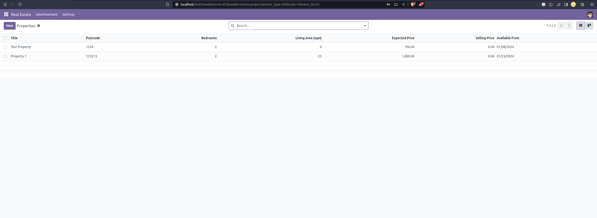

<h3 align=center>Odoo Custom Module</h3>
<p align=center>
  <span>Learning how to create custom module for Odoo.</span>
</p>

<p align="center">
  <a href="#installation">Installation</a>
  &nbsp;&nbsp;&nbsp;|&nbsp;&nbsp;&nbsp;
  <a href="#todo">Todo</a>
  &nbsp;&nbsp;&nbsp;|&nbsp;&nbsp;&nbsp;
  <a href="#references">References</a>
</p>

## Real Estate App



## Installation 

```console
# 1. clone odoo community repo
git clone https://github.com/odoo/odoo.git

# 2. change directory
cd /odoo-repo

# 3. install dependencies (Linux) 
sed -n -e '/^Depends:/,/^Pre/ s/ python3-\(.*\),/python3-\1/p' debian/control | sudo xargs apt-get install -y

# 4. provision a postgres server

# 5. provision odoo server
./odoo-bin --addons-path="addons/" -d $db-name

# 5. copy estate custom module
cp /estate /custom_module/estate

# 6. install estate custom module
./odoo-bin --addons-path="addons/, custom_module/" -d $db-name -i estate

# 7. make sure to activate developer mode on odoo settings, and update the list of apps.
```

## TODO

- [x] Chapter 1: Architecture Overview
- [x] Chapter 2: Development environment setup
- [x] Chapter 3: A New Application
- [x] Chapter 4: Models And Basic Fields
- [x] Chapter 5: Security - A Brief Introduction
- [x] Chapter 6: Finally, Some UI To Play With
- [x] Chapter 7: Basic Views
- [x] Chapter 8: Relations Between Models
- [x] Chapter 9: Computed Fields And Onchanges
- [x] Chapter 10: Ready For Some Action?
- [ ] Chapter 11: Constraints
- [ ] Chapter 12: Add The Sprinkles
- [ ] Chapter 13: Inheritance
- [ ] Chapter 14: Interact With Other Modules
- [ ] Chapter 15: A Brief History Of QWeb
- [ ] Chapter 16: The final word

## References
- Tutorial - https://www.odoo.com/documentation/17.0/developer/tutorials.html 
- How to install - https://www.odoo.com/documentation/17.0/administration/install/source.html, https://www.odoo.com/documentation/17.0/developer/tutorials/getting_started/02_setup.html


